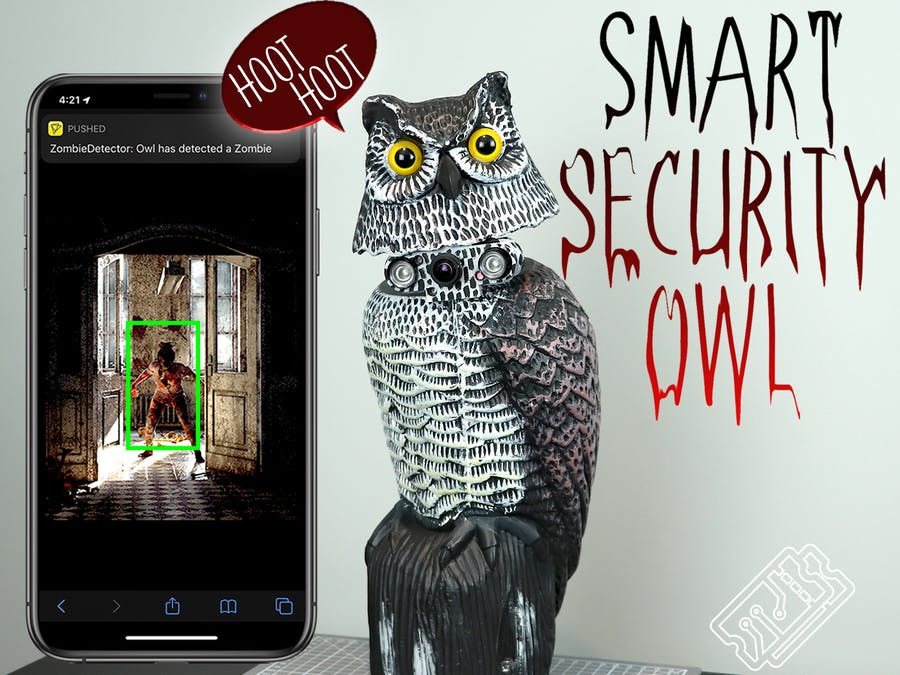
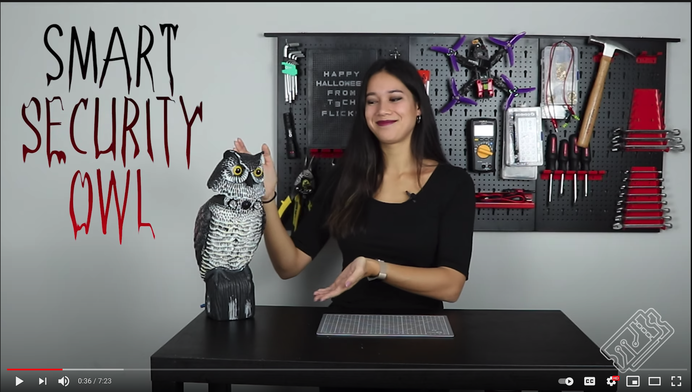

# [T3chFlicks](https://t3chflicks.org): Smart Security Owl 
> A Halloween special project 

 

🎖️ Featured by [Adafruit Blogs](https://blog.adafruit.com/2019/12/06/zombie-detecting-smart-security-owl-piday-raspberrypi-raspberry_pi/)

🎖️ Featured by [Push Notifications](https://pushed.co/blog/pushed-in-the-real-world-zombie-detecting-smart-security-owl)

## Code
### `tutorials/`
1. Move the owl head.
2. Make the owl hoot!
3. Stream the video feed.
4. Run object detection on the stream.
5. Notify your phone.

### `src/`
This is the complete working version of the code used.

### `assets/`
This contains the extra files such as the owl hoot and deep learning models.

---

This project was created by [T3chFlicks](https://t3chflicks.org) - A tech focused education and services company.

---
